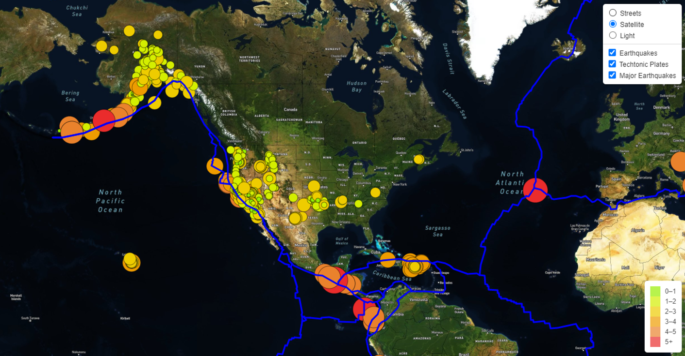

# Mapping Earthquakes
----------------------------------------------------------------------------------
 
## Project Approach
Used JavaScript and the D3.js library to retrieve coordinates and magnitudes of recent earthquakes from the GeoJSON database.  

## Skills Learnd

- Retrieve data from a GeoJSON file.
- Make API requests to a server to host geographical maps.
- Populate geographical maps with GeoJSON data using JavaScript and the Data-Driven Documents (D3) library.
- Add multiple map layers to geographical maps using Leaflet control plugins to add user interface controls.
- Use JavaScript ES6 functions to add GeoJSON data, features and interactivity to maps.
- Render maps on a local server.

The following is a picture of the rendered interactive map:  

